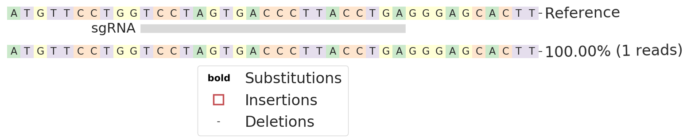
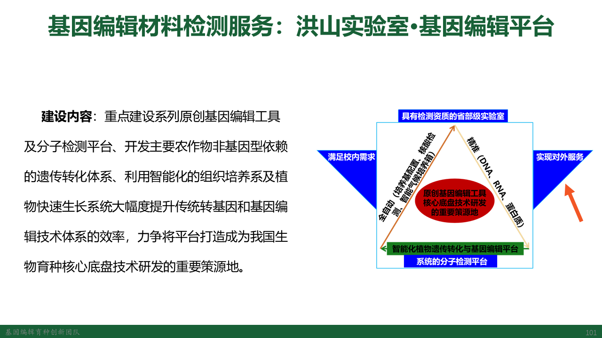
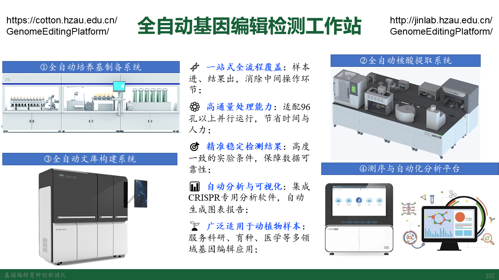

# Snakemake workflow: Snakemake CRISPR Barcode/HiTom Editing Analysis


A snakemake workflow for CRISPR barcode designer and analysis of Illimina sequences pair-end reads (based on [CRISPResso2](https://github.com/pinellolab/CRISPResso2)).

[](https://snakemake.bitbucket.io)
[](https://travis-ci.org/snakemake-workflows/rna-seq-star-deseq2)
[](https://cdn.rawgit.com/snakemake-workflows/rna-seq-star-deseq2/master/.test/report.html)


## Authors

* Zhongping Xu (@hopetogy), http://tiramisutes.github.io/

## Usage

---

请仔细阅读 **config.yaml** 文件中参数的注释说明，严格正确的配置相应参数，特别是**prefix**和**DATA**的参数。

配置文件内容请参考**Resources**目录提供的test数据进行准备。

切记：输入的任何文件内容或文件名称必须均不含特殊字符，仅可为字母、数字、中线 (-)、点 (仅可出现在文件名称中)和下划线 (_)。

---

### Step 1: Install workflow / git clone

First install [Snakemake](https://snakemake.readthedocs.io/en/stable/getting_started/installation.html):

```
conda create -n snakemake -c conda-forge -c bioconda snakemake conda-forge::colorama
conda activate snakemake
```

Then git clone this repository using follows command 👇

    git clone https://github.com/tiramisutes/Snakemake_CRISPR_Barcode_HiTom_Analysis.git

### Step 2: Prepare data
- Hi-Tom返回数据已经按照样品进行fq文件的分隔，所以只需指定样品名称对应的扩增序列和sgRNA序列即可；
- Barcode测序返回的是所有样品的混合结果，需要根据Barcode和引物序列将样品分割，所以需要准备两个文件：引物和扩增序列信息，且两个文件中的样品名称必须完全一致；

|                 | HiTom  | Barcode |
| :-------------: | :----: | ------- |
|   扩增引物信息   | 不需要  | 需要    |
| 扩增序列和sgRNA  |  需要   | 需要    |

#### 扩增序列和对应sgRNA文件
Tab分隔且各列依次为：`扩增名称，扩增序列1，靶标1，扩增序列2（可选），靶标2（可选）`；

同一扩增序列内有多个sgRNA时，在相应列用逗号分隔，参考格式如下👇

```
312	CATGAATTTTTTCCATCTGCAGTTACTAACAAGCCTAAGGTTGAGGTTCATGGAGGTGATATGAGATCCTTTTTCACCCTGGTAACTATACATGTCGCTAATACTCTCTTTTCTTTTCTTTTT	CCTAAGGTTGAGGTTCATGG	TTGATTAAGAGAAGTACCAGTGTAAGTGCTCCCTCAGGTAAGGGTCACTAGGACCAGGAACATCTGGGTCTGTCATCACCTGCAATATAAAAATATGATTGCTGATAGACATTTTCTCTTGAA	TCAGGTAAGGGTCACTAGGA
313	CATGAATTTTTTCCATCTGCAGTTACTAACAAGCCTAAGGTTGAGGTTCATGGAGGTGATATGAGATCCTTTTTCACCCTGGTAACTATACATGTCGCTAATACTCTCTTTTCTTTTCTTTTT	CCTAAGGTTGAGGTTCATGG,CCTAAGGTTGAGGTTCATGG
```
#### 引物信息文件
```
312-F	acagggTTTTACCCTTACTTATAGTTATAAA
312-R	ccctgtATGTAACCGAAGAAAGCAT
313-F	accatcTTTTACCCTTACTTATAGTTATAAA
313-R	gatggtATGTAACCGAAGAAAGCAT
```
#### HiTom数据
> Hi-Tom测序会在自己设计引物前加27bp的测序接头+barcode序列，总共就是54bp，而测序总长度为 `150 X 2 = 300bp`，且最好左右双端序列有10bp的重叠以便于合并（flash默认按照10bp重叠进行合并），所以扩增序列总长度最好小于等于236 bp。

公司返回fq测序数据压缩文件，且测序数据文件必须按照如下命名规程：`prefix前缀-样本名称-R1.fq`，例如SY207-USR-633-340-R1.fq和SY207-USR-633-340-R2.fq

- 样品名称必须与下面description文件中的第一列名称完全一致
- 必须是`R1`和`R2`，且是`-`连接

### Step 3: Configure workflow

Configure the workflow according to your needs via editing the file `config.yaml`.

### Step 4: Execute workflow

Test your configuration by performing a dry-run via

    snakemake --use-conda -n

Execute the workflow locally via

    snakemake --use-conda --cores $N

using `$N` cores or run it in a cluster environment via

    snakemake --use-conda --cluster qsub --jobs 100

or

`cluster.json`文件进行集群运行相关参数设置，因为`CRISPResso2` 程序对服务器运行没有特殊要求，通常默认即可；

    snakemake --use-conda --jobs 100 --cluster-config config/cluster.json --cluster "bsub -q {cluster.queue} -o {cluster.output} -e {cluster.error}"

See the [Snakemake documentation](https://snakemake.readthedocs.io/en/stable/executable.html) for further details.

### Step 5: Investigate results

After successful execution, you can create a self-contained interactive HTML report with all results via:

    snakemake --report report.html --report-stylesheet config/custom-stylesheet.css

This report can, e.g., be forwarded to your collaborators.
An example (using some trivial test data) can be seen [here](https://cdn.rawgit.com/snakemake-workflows/rna-seq-star-deseq2/master/.test/report.html).

## FAQ
### 1. ERROR: Error: No alignments were found
即没有测序reads比对到扩增序列，首先确认扩增序列总长度是否小于等于236 bp。

手动运行 `flash SY207-USR-633-321-1.fastq.gz SY207-USR-633-321-2.fastq.gz --min-overlap 10`命令，察看 **out.extendedFrags.fastq** 文件确认重叠reads数目。

若**out.extendedFrags.fastq** 重叠reads数目少，可设置 `--min_paired_end_reads_overlap` 参数进行一定的拯救。如果还是不行，参考[3. 如何挽救扩增序列总长度大于236 bp的结果](#3-如何挽救扩增序列总长度大于236-bp的结果)。

若**out.extendedFrags.fastq** 重叠reads数目足够多，CRISPResso`--default_min_aln_score`默认60%相似性即认为测序reads比对到扩增序列，此时可察看确认是否测序reas前面有太多的接头序列，造成比对相似值小于60%，特别是单端reads模式跑容易出现这种情况。

### 2. 图9结果reads非常少

主要原因还是比对上的reads太少。可参考 [`ERROR: Error: No alignments were found`](#1-error-error-no-alignments-were-found) 问题进行检查。
### 3. 如何挽救扩增序列总长度大于236 bp的结果
如果是双靶标且靶标位置分别在双端reads的两端序列，则分别按照单靶标跑，此时在`config.yaml`中设置参数`badreads: true`即可。

如果是单靶标则用修改后的扩增序列跑相应reads。

## 基因编辑检测



